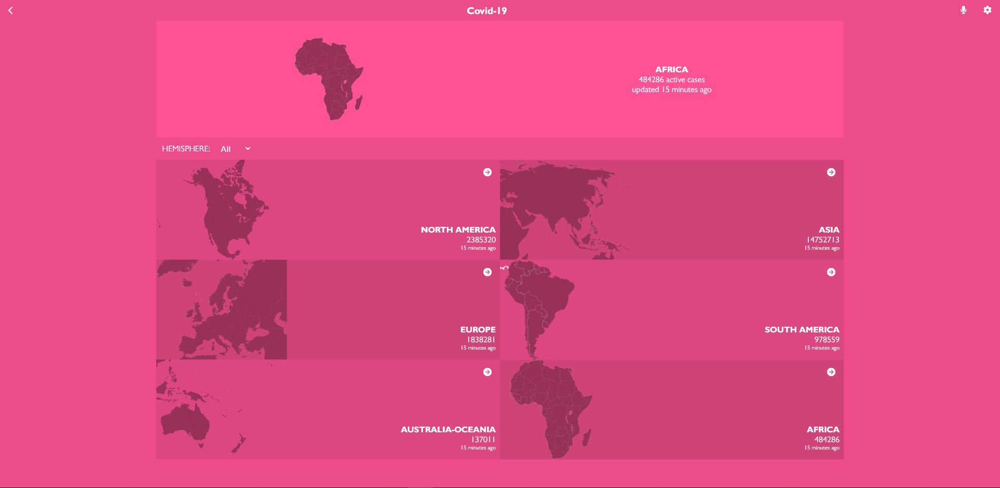
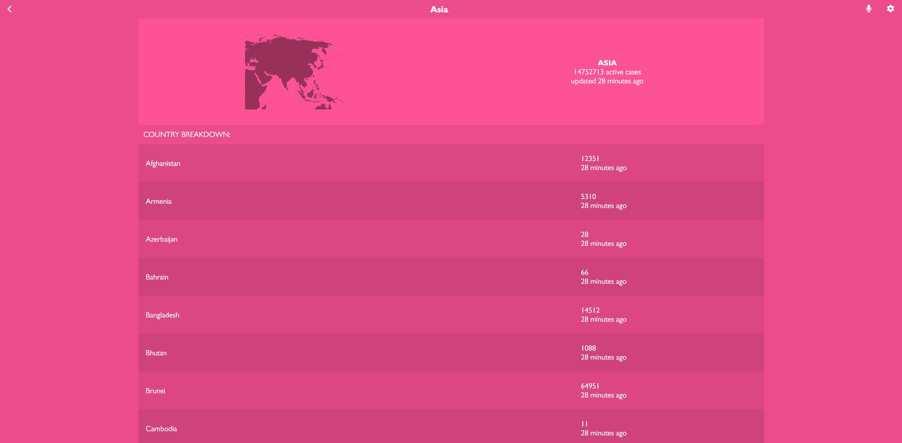

<a name="readme-top"></a>

<div align="center">

  <br/>

<h3><b>Covid-19 Metrics</b></h3>

</div>

<div align="center">
  
  
</div>

<!-- TABLE OF CONTENTS -->

# 📗 Table of Contents

- [📖 Covid-19 Metrics](#-about-project-)
    - [🛠 Built With ](#-built-with-)
        - [Tech Stack ](#tech-stack-)
        - [Key Features ](#key-features-)
    - [🚀 Live Demo ](#-live-demo-)
    - [💻 Getting Started ](#-getting-started-)
        - [Prerequisites](#prerequisites)
        - [Setup](#setup)
        - [Install](#install)
        - [Usage](#usage)
        - [Run tests](#run-tests)
        - [Deployment](#deployment)
    - [👥 Authors ](#-authors-)
    - [🔭 Future Features ](#-future-features-)
    - [🤝 Contributing ](#-contributing-)
    - [⭐️ Show your support ](#️-show-your-support-)
    - [🙏 Acknowledgments ](#-acknowledgments-)
    - [❓ FAQ (OPTIONAL) ](#-faq-optional-)
    - [📝 License ](#-license-)

<!-- PROJECT DESCRIPTION -->

# 📖 Covid-19 Metrics <a name="about-project"></a>

**Covid-19 Metrics** is a React-based web application that provides real-time information about the
number of active COVID-19 cases on each continent and allows users to explore further by displaying
the active cases for each country within a selected continent.
The primary objective of the "Covid-19 Metrics" app is to help people stay informed about the
COVID-19 situation across different continents and countries. By providing real-time data, the app
enables users to make informed decisions regarding travel plans, business operations, and general
safety measures.

## 🛠 Built With <a name="built-with"></a>

### Tech Stack <a name="tech-stack"></a>

<details>
  <summary>Client</summary>
  <ul>
    <li><a href="https://reactjs.org/">React.js</a></li>
    <li><a href="https://styled-components.com/">Styled Components</a></li>
  </ul>
</details>

<details>
  <summary>API</summary>
  <ul>
    <li><a href="https://disease.sh/">Diseases.sh</a></li>
  </ul>
</details>

<!-- Features -->

### Key Features <a name="key-features"></a>

- **Real-Time Data**
- **Continent Overview**
- **Country Breakdown**
- **User-Friendly Interface**
- **Responsive Design**

<p align="right">(<a href="#readme-top">back to top</a>)</p>

<!-- LIVE DEMO -->

## 🚀 Live Demo <a name="live-demo"></a>

- [Video presentation](https://www.loom.com/share/29a86f6742234a628d52fab2d3672f83?sid=2d776efe-947f-4a93-bd27-d1ee2ba5ec4e)
- [Live Demo Link](https://extraordinary-kitten-6a3f95.netlify.app/)

<p align="right">(<a href="#readme-top">back to top</a>)</p>

<!-- GETTING STARTED -->

## 💻 Getting Started <a name="getting-started"></a>

To get a local copy up and running, follow these steps.

### Prerequisites

In order to run this project you need:

- `NodeJS`
- `Code editor (VSCode)`

### Setup

Clone this repository to your desired folder:

```sh
  cd my-folder
  git clone https://github.com/andrianarivo/covid-19-metrics.git
```

### Install

Install this project with:

```sh
  cd my-project
  npm install
```

### Usage

To run the project, execute the following command:

```sh
  npm start
```

### Run tests

To run tests, run the following command:

```sh
  npm test
```

### Deployment

You can deploy this project using your own deployment solution (Netlify, Render, Gh-Pages)

<p align="right">(<a href="#readme-top">back to top</a>)</p>

<!-- AUTHORS -->

## 👥 Authors <a name="authors"></a>

👤 **Author1**

- GitHub: [@andrianarivo](https://github.com/andrianarivo)
- Twitter: [@dandrianarivo](https://twitter.com/dandrianarivo)
- LinkedIn: [andrianarivo](https://linkedin.com/in/andrianarivo)

<p align="right">(<a href="#readme-top">back to top</a>)</p>

<!-- FUTURE FEATURES -->

## 🔭 Future Features <a name="future-features"></a>

- [ ] **Choosing theme on runtime**

<p align="right">(<a href="#readme-top">back to top</a>)</p>

<!-- CONTRIBUTING -->

## 🤝 Contributing <a name="contributing"></a>

Contributions, issues, and feature requests are welcome!

Feel free to check the [issues page](https://github.com/andrianarivo/covid-19-metrics/issues).

<p align="right">(<a href="#readme-top">back to top</a>)</p>

<!-- SUPPORT -->

## ⭐️ Show your support <a name="support"></a>

If you like this project consider giving a ⭐

<p align="right">(<a href="#readme-top">back to top</a>)</p>

<!-- ACKNOWLEDGEMENTS -->

## 🙏 Acknowledgments <a name="acknowledgements"></a>

I would like to thank the Microverse Community!

<p align="right">(<a href="#readme-top">back to top</a>)</p>

<!-- LICENSE -->

## 📝 License <a name="license"></a>

This project is [MIT](./MIT.md) licensed.

<p align="right">(<a href="#readme-top">back to top</a>)</p>
